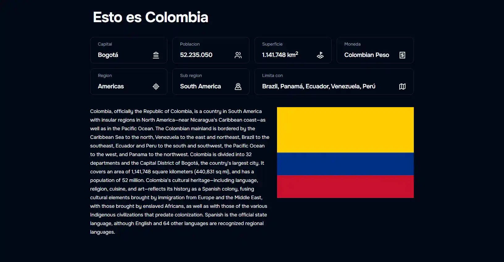

# info COLOMBIA



<div align="center">


</div>

## Introduction

Welcome to **info COLOMBIA**, an open source project leveraging [API  Colombia](https://api-colombia.com/) to display
information about the wonderful country that is Colombia, Here we show you its geography, history, tourist attractions,
presidents and more.

### About API Colombia

API Colombia offers detailed information about locations, maps, regions, departments, cities, etc. This allows our
project to display all this information in a friendly way so that everyone in the world can get to know this country.

We sincerely appreciate [Miguel Teheran](https://github.com/Mteheran) for making this valuable API available,
facilitating access to essential information about Colombia.

## Stack

- [**NEXT.js**](https://nextjs.org/) - The React Framework for the Web.
- [**Typescript**](https://www.typescriptlang.org/) - JavaScript with syntax for types.
- [**Tailwind CSS**](https://tailwindcss.com/) - Rapidly build modern websites without ever leaving your HTML.
- [**shadcn/ui**](https://ui.shadcn.com) Build your component library.

## Getting Started

### Prerequisites:

- [Node.js 18+](https://nodejs.org/en/).
- [Git](https://git-scm.com/).

1. [Fork](https://github.com/DavidCast27/colombia-info/fork) or [Clone](https://github.com/DavidCast27/colombia-info)
   this repository and clone it locally

```bash
git clone git@github.com:<your_username>/colombia-info.git
```

2. Install dependencies:

```bash
npm install
```

3. run the development server:

```bash
npm run dev
```

Open [http://localhost:3000](http://localhost:3000) with your browser to see the result.

You can edit any file by modifying `src/app/**.tsx`. The page updates automatically as you edit the file.

This project uses [`next/font`](https://nextjs.org/docs/basic-features/font-optimization) to automatically optimize and
load Onest, a custom Google Font.

## Contributors 

<a href="https://github.com/DavidCast27/colombia-info/graphs/contributors">
  
</a>

## Acknowledgments

We would like to extend our gratitude to [Miguel Teheran](https://github.com/Mteheran) for their contribution to the
community by providing this API.

## License

- [MIT](https://github.com/DavidCast27/colombia-info/blob/main/LICENSE).
